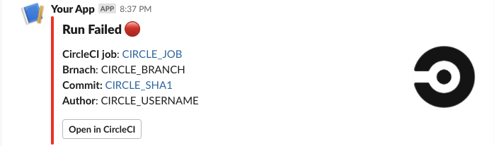
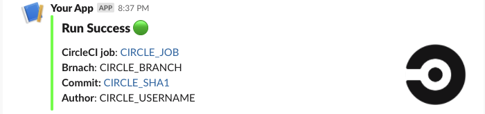
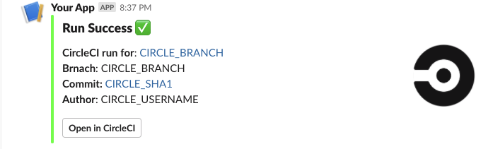
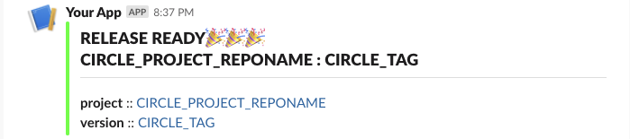

# Custom Slack-notify Orb

CircleCI Slack notifications with *custom* or *remote* templates.

## Usage & setup

Usage instuctions & examples can be found at [Orb Registry](http://circleci.com/orbs/registry/orb/openlegacy/slack-notify-orb).

## Templates

* The list of Slack message templates (JSON) can be found in [slack_templates](./src/slack_templates)
* You can use templates from this Orb, or use your own templates at remote locations. Remote template has to be a raw JSON directly accessible by `curl`.

| Template Preview  | Template  | Description |
| ------------- | ------------- | ------------- |
|   | job_fail   | FAIL template for a *JOB* |
|   | job_pass   | PASS template for a *JOB* |
|   | workflow_success   | PASS template for a *WORKFLOW* |
|   | tag_release_success   | Success template for *TAG* releases|

---

### How to Publish
* Create and push a branch with your new features.
* When ready to publish a new production version, create a Pull Request from _feature branch_ to `master`.
* The title of the pull request must contain a special semver tag: `[semver:<segement>]` where `<segment>` is replaced by one of the following values.

| Increment | Description|
| ----------| -----------|
| major     | Issue a 1.0.0 incremented release|
| minor     | Issue a x.1.0 incremented release|
| patch     | Issue a x.x.1 incremented release|
| skip      | Do not issue a release|

Example: `[semver:major]`

* Squash and merge. Ensure the semver tag is preserved and entered as a part of the commit message.
* On merge(or after manual approval) the orb will automatically be published to the Orb Registry.
